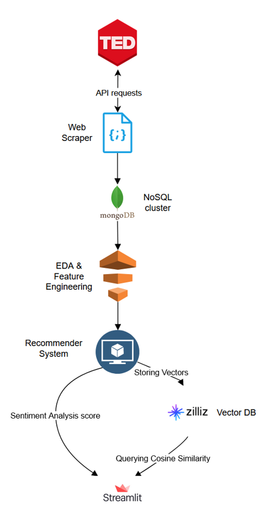

# Hi there 👋
## About me 💬
+ My name is <b>Raluca</b> and I am a passionate Data Scientist with 3.5 years of experience in reinsurance industry, working as a Senior Risk/ Quantitative Analyst and building solution to transform vast data landscapes into compelling business insights.
+ With strong background in machine learning and data modeling (NLP and (un)supervised ML), I am proficient with an array of tools for data processing and analysis: <b> Jupyter, Python, AirFlow, AWS, MSSQL/Postgresql, Git </b>.
+ I descriebe myself as a creative, self-starter with a keen mind for solving tough problems with adaptive, data-driven and automated solutions.
+ I have a PhD in Political Science from Trinity College Dublin, where I conducted a survey-experiment in Kenya and used advanced statistical models (panel models, multilevel model) to assess the political impact of Chinese economic engagement in Africa.

## Skills 💻

- Data gathering (e.g. _Python_ - requests, bs4/BeautifulSoup, boto3, pyodbc; survey-experiment; _SQL_ - MySQL, Redshift, data lake such as Dremio; _Excel_ - power query)
- Data processing (EDA using _Python_ - matplotlib, pandas, numpy, seaborn; _Excel_ - formulas, pivot)
- Modelling (R - lme4, ordinal, panelAR, plm, Python - Scikit-learn, scipy, nltk, Tyche)
- Data visualization (PowerBI, Tableau, R and Python - matplotlib, seaborn)
- Orchestrating complex data pipelines (using Aiflow)
- Cloud infrastructure (AWS - S3, EC2, Redshift)

## Languages and software that I know and/or use:

 

  

  
## Projects 🚀

### [TED talks NLP recommendation system](https://github.com/women-in-ai-ireland/September-2023-Group-001)

<strong>Keywords</strong>: unstructured data, NLP, scikit-learn, sentiment analysis, streamlit

<strong>Summary</strong>: A project part of WaiPRACTICE September cohort 2023 (WAI - Women in Ai Ireland) which involved building a content-based NLP recommendation system using sentiment analysis and similarities measures. 

<strong>Results</strong>: 
  -  Building a web scraper using API requests ([soon-to-be python library](https://github.com/RalucaN/oratix)) 
  -  [TED talks recommender Streamlit app](https://ted-recommender-app.streamlit.app/).

  **Libraries** used: 
     - `Requests` to build the web scraper → **Data Collection**; 
      
     - `pandas`, `matplotlib` and `seaborn` to explore the full dataset and unconver patterns → **Data Exploration**; 
 
     - `NLTK`, `neattext`, `re` to built a custom function to perform *basic text preprocessing* (such as tokenization, stopword removal, stemming, lemmatization) and *specific cleaning steps* (such as removing any irrelevant or noisy data, such as audio cues and the speaker names, HTML tags, punctuation, numbers) → **Data Processing**;  
 
     - `NLTK` and`VADER sentiment` libraries to perform sentiment analysis  → **Sentiment Analysis**;  
      
     - `scikit-learn` and `scipy` libraries for similarity metrics  → **Recommender System**.

You can read more about the project on the [github page](https://women-in-ai-ireland.github.io/September-2023-Group-001/). 
**Next steps**: developing the python library oratix and using transformers (BERT). 

  
### [Valheim's Steam user reviews analysis](https://github.com/RalucaN/Steam_reviews)

<strong>Keywords</strong>: API requests, NLP, sentiment analysis, unstructured data

<strong>Summary</strong>: A project that aims to analyze user reviews about the game Valheim on Steam to understand why a game with such low quality graphics has a great reception from players. This project uses: 
- **Data Collection** → `Requests` library to collect review using Steam public API  
- **Data Processing and Exploration** → `pandas`, `numpy`, `matplotlib` and `seaborn` libraries to check for duplicates, handle missing data, and transforming timedate features (UNIX to UTC format).

### [Root cause analysis for defects in production](https://github.com/RalucaN/PRODCO-DS) (root cause analysis, decision tree, neural networks)

<strong>Keywords</strong>: supervised ML, decision tree, random forest

<strong>Summary</strong>: Initially part of the Women in Data Science Accelerator 2020 (Accenture), it is project that involves conducting root cause analysis to predict defects in production using decision tree model 

Packages and software used:
- R- RPART and Python - Boruta for feature selection, 
- Python - Scikit-learn for modelling, Graphviz and dtreeviz for visualization

 
 
 
 
 
 

### [ML bits and Pieces: a collection of small ML and AI projects](https://github.com/RalucaN/MLBitsAndPieces) (NLP, KMeans)

[Find similarity of movies](https://github.com/RalucaN/MLBitsAndPieces/blob/master/FindMovieSimilarity/notebook.ipynb): An **NLP** project aiming to quantify movies' simialrities based on IMDb and Wikipedia plots which are preprocessed using **tokenization**, **stemming**, and **TFIDF** vectozation. Then, we use an unsupervised algorithm, **KMeans** to cluster the data into 5 clusters and **cosine similarity** to calculate the similarity distance between the plots of the movies.

### PhD thesis and older projects: 
- [Political Impact of Chinese Economic Engagement in Africa](https://github.com/RalucaN/Data-projects/tree/master/PhD_thesis(2015-2019)): PhD thesis - project that involved conducting a survey-experiment in Kenya and using advanced statistical models (e.g., multilevel, ordinal logistic, panel data model) to provide an in-depth assessment of the political impact of Chinese economic engagement in Africa.
- [Profiling electoral candidates](https://github.com/RalucaN/Data-projects/tree/master/Text%20analysis%20project%20using%20R%20(2016%20and%202020)): My first NLP project that involved using quanteda package and doing a content analysis of a 2016 presidential debate of US Democratic Party’s candidates.

## Achievements 🏆

Some of the achievements that I have accomplished are:

- Graduated with a PhD in Political Scienece from Trinity College Dublin.
- Completed Accenture’s “Women in Data Science Accelerator”.
- Won the Irish Research Council Government of Ireland Postgraduate Scholarship, a highly competitive and prestigious research grant with an average success rate of 18% and a total amount of €48,000.
  

## Contact 📫

If you want to reach out to me, you can find me on:

  &nbsp
  
  

## Fun facts 🎉

Some fun facts about me are:

- I am originally from Transilvania
- I am enjoy eating garlic 
- I speak several languages: English, French, Spanish and Japanese.
- I love traveling and exploring new places.

