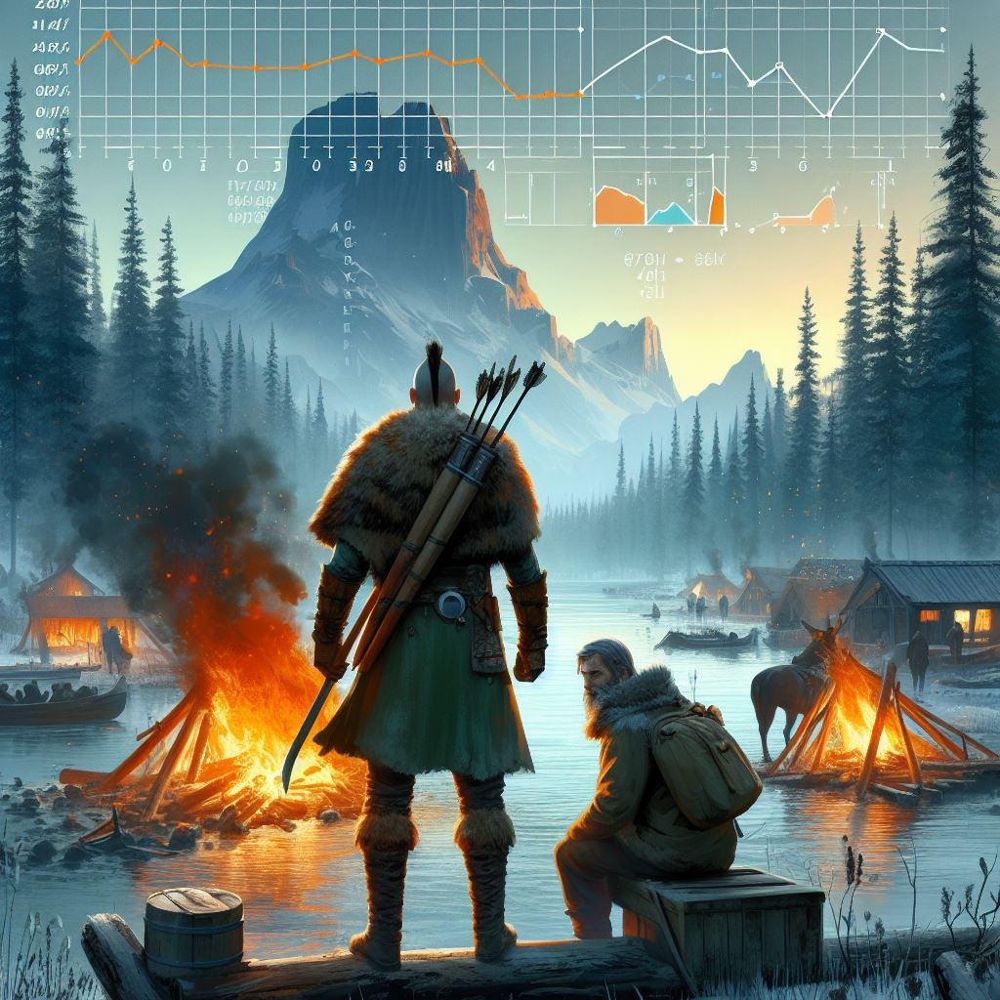
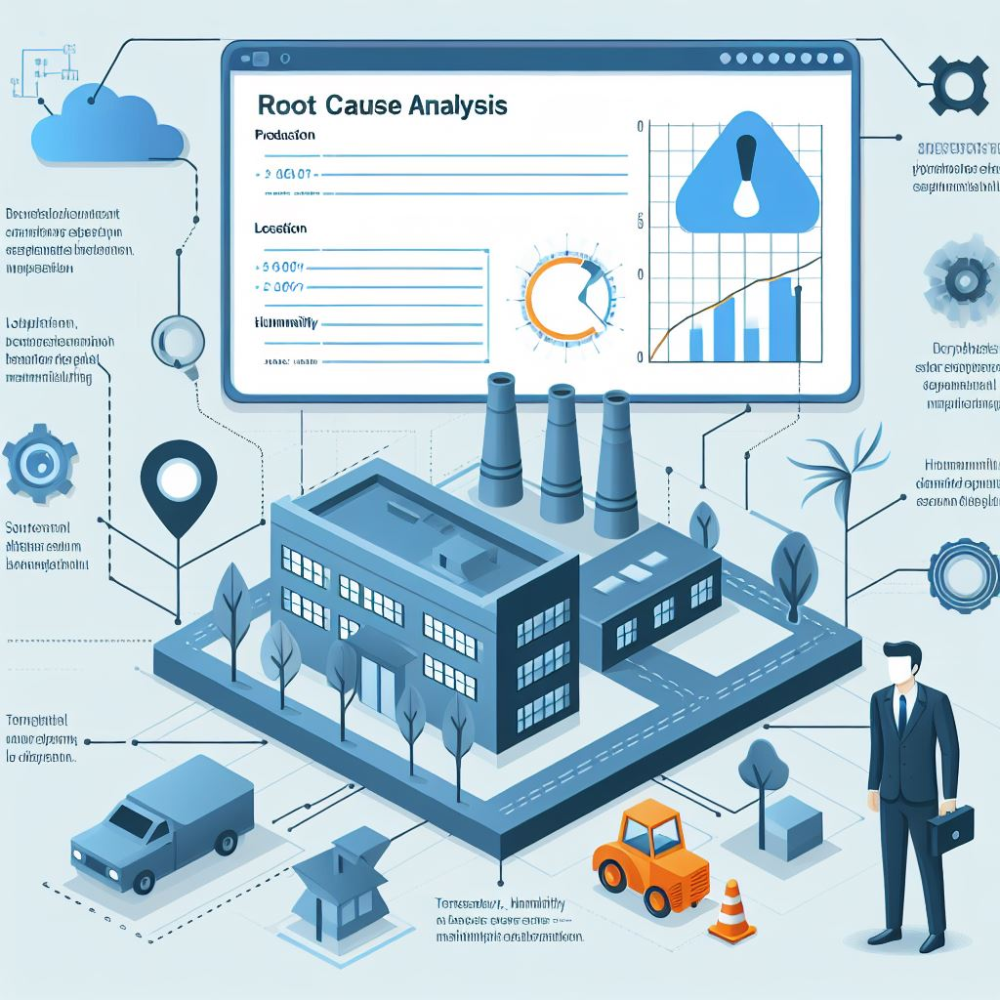
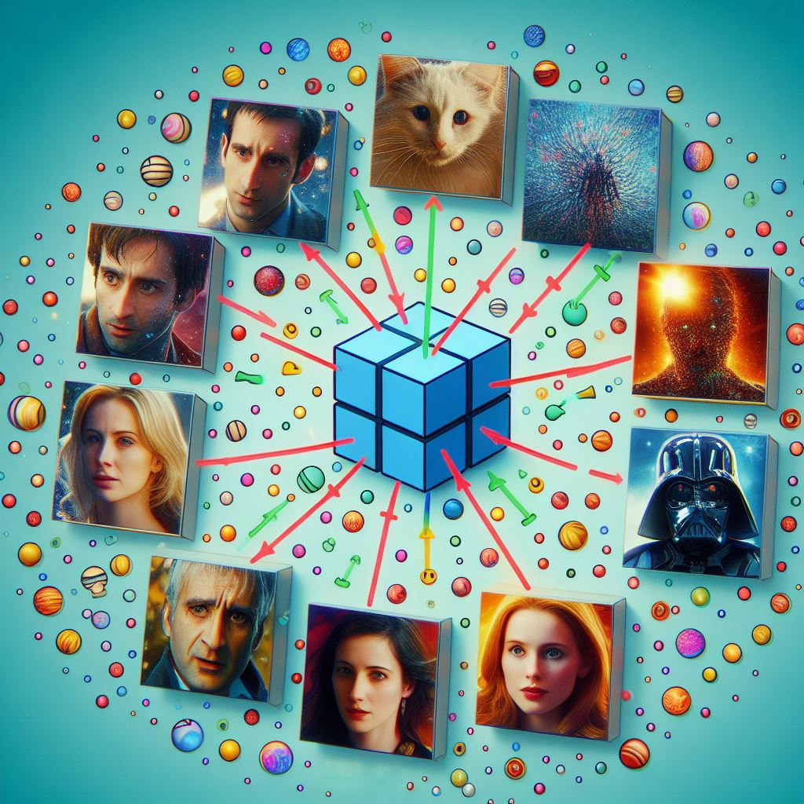

# Hi there 👋
## About me 💬
+ My name is <b>Raluca</b> and I am a passionate Data Scientist with 3.5 years of experience in reinsurance industry, working as a Senior Risk/ Quantitative Analyst and building solution to transform vast data landscapes into compelling business insights.
+ With strong background in machine learning and data modeling (NLP and (un)supervised ML), I am proficient with an array of tools for data processing and analysis: <b> Jupyter, Python, AirFlow, AWS, MSSQL/Postgresql, Git </b>.
+ I descriebe myself as a creative, self-starter with a keen mind for solving tough problems with adaptive, data-driven and automated solutions.
+ I have a PhD in Political Science from Trinity College Dublin, where I conducted a survey-experiment in Kenya and used advanced statistical models (panel models, multilevel model) to assess the political impact of Chinese economic engagement in Africa.

## Skills 💻

- Data gathering (e.g. _Python_ - requests, bs4/BeautifulSoup, boto3, pyodbc; survey-experiment; _SQL_ - MySQL, Redshift, data lake such as Dremio; _Excel_ - power query)
- Data processing (EDA using _Python_ - matplotlib, pandas, numpy, seaborn; _Excel_ - formulas, pivot)
- Modelling (R - lme4, ordinal, panelAR, plm, Python - Scikit-learn, scipy, nltk, Tyche)
- Data visualization (PowerBI, Tableau, R and Python - matplotlib, seaborn)
- Orchestrating complex data pipelines (using Aiflow)
- Cloud infrastructure (AWS - S3, EC2, Redshift)

## Languages and software that I know and/or use:

 

  

  
## Projects 🚀

### [Content-based NLP recommendation system using TED talks](https://github.com/women-in-ai-ireland/September-2023-Group-001)

**Keywords**: Unstructured data, NLP, scikit-learn, sentiment analysis, similarity, Streamlit

**Cohort**: **WaiPRACTICE September Cohort 2023** by **Women in AI Ireland (WAI)** ([github page](https://women-in-ai-ireland.github.io/September-2023-Group-001/)).

**Summary**: Built a content-based recommendation system using NLP techniques, sentiment analysis and similarity measures.
  
**Key steps**:
- Web scraping with API requests.
- [TED talks recommender app using Streamlit](https://ted-recommender-app.streamlit.app/).
- Libraries: `Requests`, `pandas`, `NLTK`, `scikit-learn`  and `scipy`
 

**Next Steps**:
- Publish the [**oratix** Python library](https://github.com/RalucaN/oratix)
- Explore transformers (BERT) for further enhancements.

 

### [Valheim's Steam user reviews analysis](https://github.com/RalucaN/Steam_reviews)

**Keywords**: API requests, NLP, sentiment analysis, unstructured data

**Summary**: A project that aims to analyze user reviews about the game Valheim on Steam to understand why a game with such low quality graphics has a great reception from players.

**Key steps**:
- Reviews collections using Steam public API.
- Sentiment analysis using a pre-trained BERT transformer.
- EDA process uncovered user exploits
- Python libraries: `pandas`, `numpy`, `matplotlib` and `seaborn`

**Next steps**:

 

### [Root cause analysis for defects in production](https://github.com/RalucaN/PRODCO-DS) (root cause analysis, decision tree, neural networks)

**Keywords**: supervised ML, decision tree, random forest 

**Cohort**: Women in Data Science Accelerator 2020 (Accenture) 

**Summary**: Conducted a root cause analysis to predict defects in production using decision tree model 

**Key steps**:
- Sofiware: R, Python, Tableau
- Libraries: `RPART`, `Boruta`, `Scikit-learn` , `Graphviz`, `dtreeviz`

**Next steps**:

 
 
 

### [Find movies' similarity](https://github.com/RalucaN/MLBitsAndPieces/blob/master/FindMovieSimilarity/notebook.ipynb) (NLP, KMeans/Clustering, Unsupervised Learning)

**Keywords**: Movie Similarity, NLP, KMeans, Cosine Similarity, Clustering, Unsupervised Learning

**Summary**: an NLP project endeavor that quantifies the similarities between movies based on their IMDb and Wikipedia plots. It aims to provide insights into movie relationships and group them into meaningful clusters.

**Key Steps**:
- Data Preprocessing using NLP techniques, such as Tokenization, Stemming and TF-IDF Vectorization
- Performed unsupervised learning with KMeans by first determine optimal clusters using the elbow method and assign movies to clusters.
- Used Cosine Similarity to measure similarity distances between movie plots.

**Next Steps**:
- Explore additional features (e.g., genre, director) for improved clustering.
- Visualize clusters and explore movie recommendations within each cluster.

 

### [Hotel Bookings](https://github.com/RalucaN/MLBitsAndPieces/blob/master/HotelBookings/notebook.ipynb) (SVM, classification, decision boundaries)

**Keywords**: support vector machine, classification, feature engineering, hyperparameter tuning

**Summary**: The project aims to predict whether a hotel booking will be canceled or not, using a support vector machine (SVM) classifier, using a data set containing information about the lead time, average daily rate, number of weekend nights, arrival week number of each booking etc.

**Key Steps**:
- Preprocessing the data by scaling the numerical features and creating new binary and interactive features
- Selecting the most informative features based on mutual information scores
- Tuning the SVM hyperparameters using grid search cross-validation
- Evaluating the best model on the test set and plotting the decision boundaries for different kernels

**Next Steps**:
- Compare the performance of the SVM classifier with other machine learning models, such as logistic regression, decision tree, or random forest
- Explore the effect of different feature selection methods, such as chi-square test, ANOVA, or recursive feature elimination
- Analyze the factors that influence the cancelation probability and provide recommendations to reduce it
- Deploy the model as a web application or a dashboard that can interact with real-time data

 

### [Predicting crops based on soil metrics](https://github.com/RalucaN/MLBitsAndPieces/blob/master/SoilCrops/notebook.ipynb) (neural network, tensorflow, keras, random forest classifier)

**Keywords**: crop type prediction, soil metrics, tensorflow, keras, scikit-learn, logistic regression, random forest classifier, neural network.

**Summary**: This project predicts the best crop type for a soil sample based on four soil metrics: N, P, K, and pH, using Logistic Regression, Random Forest Classifier and Neural Network

**Key Steps**:
- explores three machine learning algorithms: logistic regression, random forest, and neural network from `tensorflow`
- evaluates the model's performance using metrics such as F1-score and confusion matrix from `scikit-learn`

**Next Steps**: Collect more data from different regions and seasons to validate the model on new data.

 
 

### PhD thesis and older projects: 
- [Political Impact of Chinese Economic Engagement in Africa](https://github.com/RalucaN/Data-projects/tree/master/PhD_thesis(2015-2019)): PhD thesis - project that involved conducting a survey-experiment in Kenya and using advanced statistical models (e.g., multilevel, ordinal logistic, panel data model) to provide an in-depth assessment of the political impact of Chinese economic engagement in Africa.
- [Profiling electoral candidates](https://github.com/RalucaN/Data-projects/tree/master/Text%20analysis%20project%20using%20R%20(2016%20and%202020)): My first NLP project that involved using quanteda package and doing a content analysis of a 2016 presidential debate of US Democratic Party’s candidates.

## Achievements 🏆

Some of the achievements that I have accomplished are:

- Graduated with a PhD in Political Scienece from Trinity College Dublin.
- Completed Accenture’s “Women in Data Science Accelerator”.
- Won the Irish Research Council Government of Ireland Postgraduate Scholarship, a highly competitive and prestigious research grant with an average success rate of 18% and a total amount of €48,000.
  

## Contact 📫

If you want to reach out to me, you can find me on:

  &nbsp
  
  

## Fun facts 🎉

Some fun facts about me are:

- I am originally from Transilvania
- I am enjoy eating garlic 
- I speak several languages: English, French, Spanish and Japanese.
- I love traveling and exploring new places.

