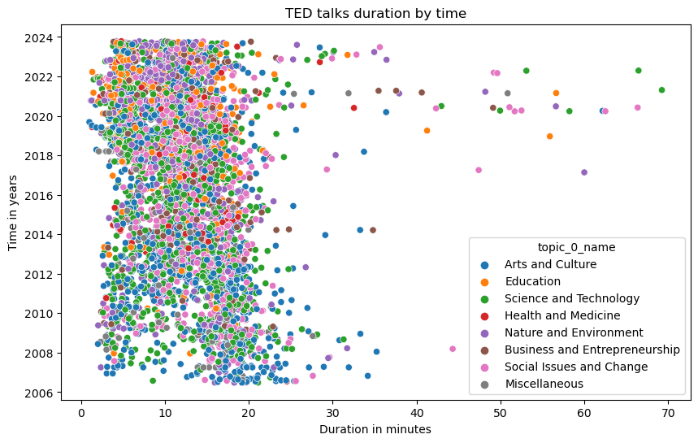

# Hi there 👋
## About me 💬
+ My name is <b>Raluca</b> and I am an accomplished Senior Analytics Professional with 3.5 years of experience [in reinsurance industry] in transforming vast data landscapes into compelling business insights.
+ With strong background in machine learning and data modeling (NLP and (un)supervised ML), I am proficient with an array of tools for data processing and analysis: <b> Jupyter, Python, AirFlow, AWS, MSSQL/Postgresql, Git </b>.
+ A creative, self-starter with a keen mind for solving tough problems with adaptive, data-driven and automated solutions.
+ I have a PhD in political science from Trinity College Dublin, where I conducted a survey-experiment in Kenya and used advanced statistical models to assess the political impact of Chinese economic engagement in Africa.

## Skills 💻

- Data gathering (e.g. _Python_ - requests, bs4/BeautifulSoup, boto3, pyodbc; survey-experiment; _SQL_ - MySQL, Redshift, data lake such as Dremio; _Excel_ - power query)
- Data processing (EDA using _Python_ - matplotlib, pandas, numpy, seaborn; _Excel_ - formulas, pivot)
- Modelling (R - lme4, ordinal, panelAR, plm, Python - Scikit-learn, Tyche)
- Data visualization (PowerBI, Tableau, R and Python - matplotlib, seaborn)
- Orchestrating complex data pipelines (using Aiflow)
- Cloud infrastructure (AWS - S3, EC2, Redshift)

## Languages and software that I know and/or use:

  

  
## Projects 🚀
In this section, I will present a list of projects that are part of my portfolio, both current and past projects: 
[TED talks NLP recommendation system](https://github.com/RalucaN/RalucaN/blob/master/README.md#1-ted-talks-nlp-recommendation-system-unstructured-data-nlp-scikit-learn-sentiment-analysis)  
[Steam User reviews](https://github.com/RalucaN/RalucaN/blob/master/README.md#2-steam-reviews-api-requests-nlp-sentiment-analysis)  
[Root cause analysis for defects in production](https://github.com/RalucaN/RalucaN/blob/master/README.md#3-root-cause-analysis-for-defects-in-production-root-cause-analysis-decision-tree-neural-networks)  

Feel free to check any of the projects listed above by reading the summary/overview or explore the individual git repository of the project. 

Otherwise, you can skip to the [Achievements](https://github.com/RalucaN/RalucaN/blob/master/README.md#achievements-) section

---

### 1. [TED talks NLP recommendation system](https://github.com/women-in-ai-ireland/September-2023-Group-001) (unstructured data, NLP, scikit-learn, sentiment analysis)

**Summary**: A project part of WaiPRACTICE September cohort 2023 (WAI - Women in Ai Ireland) which involved building a content-based NLP recommendation system using sentiment analysis and similarities measures. I also built a web scraper using API requests ([soon-to-be python library](https://github.com/RalucaN/oratix)) and a [TED talks recommender Streamlit app](https://ted-recommender-app.streamlit.app/).

  TED Project Diagram 
  

  **Libraries** used: 
   
     - `Requests` to build the web scraper → **Data Collection**; 
      
     - `pandas`, `matplotlib` and `seaborn` to explore the full dataset and unconver patterns → **Data Exploration**; 
      
     For example, the graph below shows that most TED talks last between 4 and 20 minutes, but some topics have longer talks over time. ‘Social Issue and Change’ and ‘Science and Technology’ talks have grown in length and popularity, while ‘Arts and Culture’ talks are experiencing a decreasing trend.
      
     

       

     - `NLTK`, `neattext`, `re` to built a custom function to perform *basic text preprocessing* (such as tokenization, stopword removal, stemming, lemmatization) and *specific cleaning steps* (such as removing any irrelevant or noisy data, such as audio cues and the speaker names, HTML tags, punctuation, numbers) → **Data Processing**;  
      
     - `NLTK` and`VADER sentiment` libraries to perform sentiment analysis  → **Sentiment Analysis**;  
      
     
     - `scikit-learn` and `scipy` libraries for similarity metrics  → **Recommender System**.

**Next steps**: developing the python library oratix and using transformers (BERT).

---
  
### 2. [Steam reviews](https://github.com/RalucaN/Steam_reviews) (API requests, NLP, sentiment analysis)
A project that aims to analyze user reviews about the game Valheim on Steam to understand why a game with such low quality graphics has a great reception from players. This project uses: 
- **Data Collection** → `Requests` library to collect review using Steam public API  
- **Data Processing and Exploration** → `pandas`, `numpy`, `matplotlib` and `seaborn` libraries to check for duplicates, handle missing data, and transforming timedate features (UNIX to UTC format).

---

### 3. [Root cause analysis for defects in production](https://github.com/RalucaN/PRODCO-DS) (root cause analysis, decision tree, neural networks)

**Summary**: Initially part of the Women in Data Science Accelerator 2020 (Accenture), it is project that involves conducting root cause analysis to predict defects in production using decision tree model (R- RPART and Python - Boruta for feature selection, Python - Scikit-learn for modelling, Graphviz and dtreeviz for visualization).

---

Here are some of the projects that I have worked on:
- [Political Impact of Chinese Economic Engagement in Africa](https://github.com/RalucaN/Data-projects/tree/master/PhD_thesis(2015-2019)): PhD thesis - project that involved conducting a survey-experiment in Kenya and using advanced statistical models (e.g., multilevel, ordinal logistic, panel data model) to provide an in-depth assessment of the political impact of Chinese economic engagement in Africa.
- [Profiling electoral candidates](https://github.com/RalucaN/Data-projects/tree/master/Text%20analysis%20project%20using%20R%20(2016%20and%202020)): My first NLP project that involved using quanteda package and doing a content analysis of a 2016 presidential debate of US Democratic Party’s candidates.

## Achievements 🏆

Some of the achievements that I have accomplished are:

- Graduated with a PhD in Political Scienece from Trinity College Dublin.
- Completed Accenture’s “Women in Data Science Accelerator”.
- Won the Irish Research Council Government of Ireland Postgraduate Scholarship, a highly competitive and prestigious research grant with an average success rate of 18% and a total amount of €48,000.
  

## Contact 📫

If you want to reach out to me, you can find me on:

  &nbsp
  
  

## Fun facts 🎉

Some fun facts about me are:

- I am originally from Transilvania
- I am enjoy eating garlic 
- I speak several languages: English, French, Spanish and Japanese.
- I love traveling and exploring new places.

